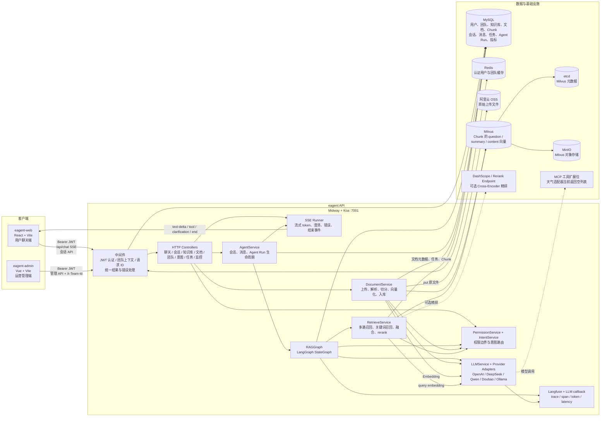
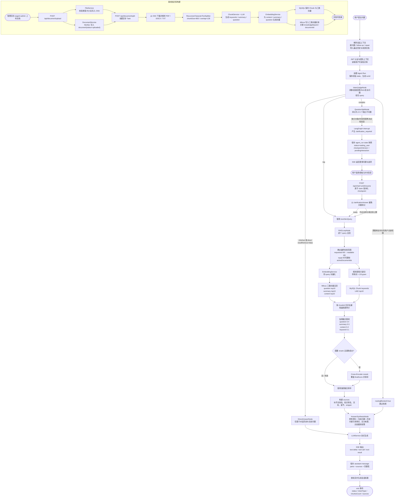
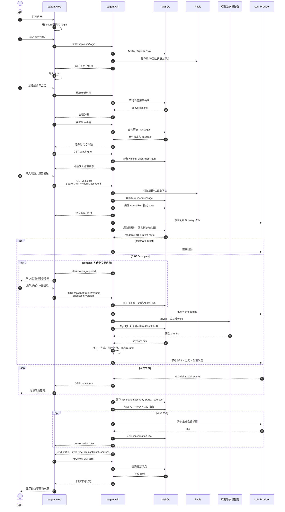

本文档基于当前仓库中的 `eagent`、`eagent-web` 和 `eagent-admin` 实现整理。三张图分别回答：

1. 系统由哪些应用、服务和存储组成；
2. 一次文档入库和一次 RAG 问答分别如何流转；
3. 用户从登录、选择会话到获得答案的完整使用链路是什么。

## 1. 系统架构图

### 架构要点

- `eagent-web` 是普通用户入口，当前路由集中在 `/login`、`/register`、`/chat` 和 `/chat/:conversationId`。
- `eagent-admin` 是管理入口，覆盖概览、知识库、文档与 Chunk、会话、意图、团队、监控和质量中心。
- 所有受保护请求先经过 JWT 校验，并解析用户团队、当前团队和可用知识库范围；Redis 仅作为认证上下文缓存，故障时回源 MySQL。
- MySQL 是业务事实存储；OSS 保存原始文件；Milvus 保存向量检索索引。Milvus 的 standalone 部署依赖 etcd 和 MinIO。
- 向量检索和答案生成均通过 `LLMService` 的 provider adapter 选择模型；可选 rerank 服务只改变候选排序，不改变业务权限范围。
- 观测链路使用 Langfuse trace/span，并将 LLM token、耗时、模型、请求 ID 等记录到观测数据表。

## 2. RAG 主要流程图

### RAG 流程中的关键实现

- 普通问题直接进入一次检索；复杂问题先由 LLM 拆分，再对每个子问题执行检索，最后按 `finalScore` 去重并取全局 Top 8。
- 当前检索是“多路召回 + 精排”：Milvus 的 question、summary、content 三路各取 Top 10，MySQL 关键词召回补充候选，默认最终每个子问题取 Top 4。
- rerank 未配置、缺少 API Key、HTTP 失败或响应无 `results` 时，自动回退到加权融合排序。
- repair 请求会从历史中找到最近一个有效用户问题，强制重新检索，并优先限制到上次回答引用过的文档。
- 澄清恢复的业务快照由 `agent_run` 管理；代码已注册 LangGraph checkpointer，但当前流式执行与恢复仍以 `Agent Run + state snapshot` 为主。
- 流式答案结束后，后端把答案、结构化 `parts`、来源和 `is_complete` 写回消息表；客户端刷新时会重新加载会话详情和 pending run。

## 3. 用户使用链路图

### 用户端可见的分支

- **正常问答**：发送后实时显示 token，结束后展示来源和会话标题。
- **无检索问答**：问候、感谢、简单确认或可由历史直接回答的问题绕过知识库。
- **复杂问题**：系统可能先请求澄清；用户补充后沿同一个 `runId` 恢复。
- **停止生成**：前端调用 `AbortController`，后端将未完成 assistant message 标记为 `is_complete=false`，并提供重试入口。
- **重新回答**：前端复用最后一条用户消息；repair 语义会强制重新检索，并保留上下文。
- **刷新恢复**：进入会话时同时加载历史消息和待处理 Agent Run，等待澄清的会话可恢复交互。

## 4. 代码映射

| 能力 | 主要代码 |
| --- | --- |
| Agent 图与路由 | `eagent/src/agent/graph.ts` |
| Agent 状态 | `eagent/src/agent/state.ts` |
| 意图判断与权限路由 | `eagent/src/agent/nodes/intentJudge.node.ts` |
| 复杂问题拆分与澄清 | `eagent/src/agent/nodes/questionSplit.node.ts` |
| RAG 循环与来源构建 | `eagent/src/agent/nodes/ragLoop.node.ts` |
| 召回、融合与 rerank | `eagent/src/service/retrieve.service.ts` |
| 文档解析、分块、Embedding 入库 | `eagent/src/service/document.service.ts`、`eagent/src/service/chunk.service.ts` |
| OSS 文件上传 | `eagent/src/service/file.service.ts` |
| Milvus 向量集合 | `eagent/src/service/milvus.service.ts` |
| 聊天 SSE 与 resume API | `eagent/src/controller/chat.controller.ts` |
| 会话与消息编排 | `eagent/src/agent/agent.service.ts` |
| 用户聊天交互 | `eagent-web/src/pages/Chat/components/MessageInput.tsx` |
| 用户端路由 | `eagent-web/src/router/index.tsx` |
| 管理端路由 | `eagent-admin/src/router/index.ts` |
